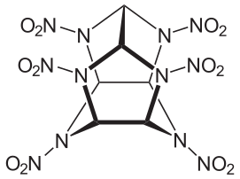
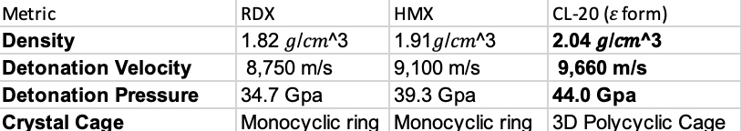

# Research-paper-breakdowns
Expanding my skill set by getting comfortable navigating research papers, in primarily but not limited to, chemistry and physics. I will also be attempting to use Biopython and other such software to support my understanding as well as to learn how to master that software as well!!
# Synthesis of Hexanitrohexaazaisowurtzitane (CL-20)
## The most powerful non-nuclear explosive

### What is CL-20?
CL-20 (chemically known as HNIW, short for hexanitrohexaazaisowurtzitane) is a polycyclic nitramine compound. It holds the distinction of being the most powerful non-nuclear explosive.

### Structure Highlights
Unlike flat or simple ring structures (like TNT or RDX), CL-20 features a 3D "caged" (isowurtzitane) molecular architecture. Attached to this cage are 6 nitramine ($\text{NO}_2$) groups.

### History and First Synthesis of CL-20
It was first synthesized by Dr. Arnold T. Nielsen and his team at the Naval Weapons Center, China Lake, CA.

During the Cold War, weapons researchers were searching for explosives with significantly higher energy densities than standard nitramines (RDX and HMX) to extend missile ranges and increase warhead effectiveness without enlarging weapon sizes.

The "CL" in the nomenclature represents China Lake, and "20" was the specific designation assigned to this formulation.

Initial tests confirmed that CL-20 delivered ~14% to 20% higher performance metrics (detonation velocity and pressure) compared to HMX—the previous benchmark for military explosives.

### Energy Source

* **High Ring Strain:** Breaking this complex caged ring structure releases significant stored framework enthalpy.
* **Oxygen Balance:** The $\text{N--NO}_2$ nitramine bonds are energetic and cleavage is readily initiated by shock or thermal stimulation. The oxygen binds to carbon to form $\text{CO}_2$ or $\text{CO}$, alongside water vapor ($\text{H}_2\text{O}$), while nitrogen atoms form strong triple bonds to yield highly stable $\text{N}_2$ gas.

This is the main energy source: a tiny volume of solid CL-20 rapidly converts into thousands of times its volume in gas accompanied by tremendous heat release. The thermal expansion of these gaseous products drives a detonation velocity of ~9,600 m/s.

### Performance Metrics

### Primary Uses

* **Solid Rocket Propellants:** Used as a high-energy additive in missile and space boosters to increase payload capability or range.
* **High-Performance Warheads:** Applied in shaped charges and armor-penetrating munitions where maximum velocity and concentrated blast pressure are required.
* **Plastic Bonded Explosives (PBX):** Blended with polymer binders to create safer, less sensitive warhead formulations.

### Dangers and Key Limitations

* **Mechanical Sensitivity:** In its pure form, CL-20 is noticeably more sensitive to impact, friction, and electrostatic discharge than HMX or RDX. Uncontrolled handling of pure crystals presents a significant detonation risk.
* **Polymorphic Phase Shifts:** Under certain temperatures or solvent exposures, the stable $\epsilon$-form can shift into more sensitive polymorphs ($\alpha$, $\beta$, or $\gamma$), increasing safety hazards during storage.
* **High Production Cost:** Synthesis historically required expensive precious metal catalysts (like palladium) and multi-step precursor processing, driving costs up significantly compared to standard nitramines.
* **Ecotoxicity Concerns:** Environmental studies indicate that while CL-20 binds strongly to organic soil fractions, its degradation pathways pose potential toxicity risks to soil organisms if released into ecosystems.
# Comparative Analysis: US Navy Patent vs. Mandal et al. (HEMRL)

Evaluating US Navy Patent **US9056868B1** (Michael E. Wright) and **Process Optimization for Synthesis of CL-20** (A. K. Mandal et al.) to understand how different engineering approaches address precursor synthesis, nitration efficiency, and process scalability.

### Why is CL-20 Difficult to Manufacture?
Traditionally, making CL-20 requires creating a temporary molecular "cage" (a precursor) bound to benzyl groups. Removing those benzyl groups to prepare the cage for final nitration requires:
* Multiple synthetic steps and separate reactions.
* Expensive precious-metal catalysts (like Palladium on Carbon, Pd/C).
* Chemical additives (like bromine) that destroy or deactivate the catalyst after a single batch, preventing catalyst recycling.

Because of catalyst degradation and complex processing, manufacturing CL-20 historically carried a high cost per pound.

---

### Key Technical Comparison

#### 1. Synthesis & Deprotection
* **The Mandal/HEMRL Route:** Uses standard TAIW ($\text{tetraacetylisowurtzitane}$) as the primary precursor. TAIW retains un-acetylated amine sites, requiring a strong nitrating agent ($\text{HNO}_3 + \text{H}_2\text{SO}_4$) to achieve full replacement of acetyl groups with nitramine ($\text{N-NO}_2$) moieties.
* **The Wright/Navy Route:** Addresses catalyst deactivation by replacing standard benzyl groups with bulkier **arenzyl groups** (such as 2-naphthylmethyl). These bulkier groups weaken the framework $\text{N-C}$ bonds, allowing deprotection and conversion to TADA under low pressure ($50\text{ psig }\text{H}_2$) and mild heat ($50^\circ\text{C}$) without catalyst-deactivating additives—enabling complete catalyst recovery and continuous flow operations.

#### 2. Nitration Optimization & Safety Envelopes
* **Mandal et al. Parameter Studies:**
  * **Addition Temperature:** Demonstrated that adding TAIW to the acid mixture at $25^\circ\text{C}$ yields identical purity and output to sub-zero addition ($0\text{--}5^\circ\text{C}$), eliminating the need for industrial cryostats.
  * **Temperature Envelope:** Identified an optimal reaction window of $83 \pm 2^\circ\text{C}$. Operating below $80^\circ\text{C}$ extends reaction time by 2 hours; exceeding $85^\circ\text{C}$ accelerates product decomposition and hazardous $\text{NO}_x$ off-gassing.
  * **Acid Concentration:** Nitronium ion ($\text{NO}_2^+$) formation and intermediate solubility require high-strength acid ($98\%\ \text{HNO}_3$) at a high molar excess ($64\text{ equivalents}$).
  * **Reaction Time:** Reduced nitration time from 4 hours down to 1 hour by introducing continuous mechanical agitation ($110\text{--}120\text{ RPM}$), preventing localized hot spots.

#### 3. Crystallization & Polymorphic Control
* **Mandal et al. (Anti-Solvent Drowning):** Dissolves crude CL-20 in ethyl acetate and precipitates it via controlled addition of $n$-heptane. Adjusting agitation speed and addition rates controls particle distribution from fine ($10\ \mu\text{m}$) to standard coarse ($150\ \mu\text{m}$).
* **Wright Patent (PAO Saturated System):** Suspends crude CL-20 in non-volatile Poly Alpha-Olefins (PAO) combined with volatile co-solvents (ethyl acetate/butyl acetate). Evaporating volatile co-solvents under reduced pressure ($50\text{--}100\text{ torr}$) forces precipitation of dense $\epsilon$-polymorph crystals ($50\text{--}200\ \mu\text{m}$ size).

---

### Core Takeaways

* **Catalyst Lifetime vs. Acid Demand:** Wright's method minimizes precious-metal consumption through recyclable catalytic flow systems, whereas Mandal's nitration optimization relies on a large excess of mixed acid ($64:12$ ratio) to maintain intermediate solubility in batch mode.
* **Batch Scalability vs. Continuous Processing:** Mandal's parameters provide an actionable blueprint for scaling batch reactors safely using standard plant equipment. Conversely, Wright's chemical modifications are designed for continuous-flow manufacturing.

